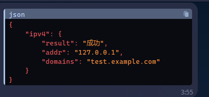

# Telegram Notice

📬 基于 Telegram Bot 的消息通知工具。

[](https://github.com/jwwsjlm/telegram-notice/releases)
[](LICENSE)
[](https://golang.org)
[](https://t.me/fengtian_bot)

---

## ✨ 功能特性

- 📬 **消息通知** - 通过 Telegram 发送通知
- 🔐 **多用户支持** - 一个 Bot 对应多个用户
- 🔗 **Webhook 支持** - HTTP 接口发送消息
- 📝 **Markdown** - 支持 Markdown 格式消息
- 🌐 **GET/POST** - 支持两种请求方式

---

## 🚀 快速开始

### 方式一：使用现成 Bot（推荐）

1. 打开 Telegram，搜索 [@fengtian_bot](https://t.me/fengtian_bot)
2. 发送 `/start` 启动机器人
3. 发送 `/gethook` 获取你的专属 Webhook URL
4. 使用返回的 URL 发送消息

**示例：**
```bash
# GET 请求
curl "https://notify.xsojson.com/webhook/<你的 MD5>?text=Hello"

# POST 请求
curl -X POST "https://notify.xsojson.com/webhook/<你的 MD5>" -d "消息内容"
```

### 方式二：自建服务

#### 源码编译

```bash
git clone https://github.com/jwwsjlm/telegram-notice.git
cd telegram-notice
go build -o telegram-notice .
```

#### 配置

1. 复制示例配置文件：
   ```bash
   cp example.config.ini config.ini
   ```

2. 编辑 `config.ini`，填入你的 Bot Token（从 [@BotFather](https://t.me/BotFather) 获取）

#### 运行

```bash
./telegram-notice
# 默认监听端口：2095
```

---

## 📖 使用说明

### 获取用户 ID

发送 `/getwebhook` 命令给机器人，会返回当前用户对应的 ID（MD5 加密）。

### 发送消息

#### GET 请求

```bash
curl "http://127.0.0.1:2095/webhook/<MD5>?text=消息内容"
```

#### POST 请求

```bash
curl -X POST "http://127.0.0.1:2095/webhook/<MD5>" \
  -H "Content-Type: application/json" \
  -d '{"text":"消息内容"}'
```

### 支持 Markdown

```bash
# 使用反引号包裹 Markdown 内容
curl "http://127.0.0.1:2095/webhook/<MD5>?text=\`**加粗**\`"
```

---

## ⚙️ 配置说明

### config.ini 示例

```ini
[telegram]
bot_token = 你的 Bot Token

[server]
port = 2095
```

---

## 📸 使用截图

### Markdown 消息示例


---

## 🔧 高级用法

### 多用户消息分发

每个用户通过 `/gethook` 获取独立的 Webhook URL，实现消息隔离。

### 集成示例

#### DDNS 通知
```bash
# 在 DDNS 脚本中添加
curl "https://notify.xsojson.com/webhook/<MD5>?text=IP 已更新"
```

#### 服务器监控
```bash
# 监控脚本
if [ $cpu_usage -gt 80 ]; then
  curl "https://notify.xsojson.com/webhook/<MD5>?text=CPU 使用率过高！"
fi
```

#### 网站状态监控
```bash
# 网站宕机通知
if ! curl -s https://example.com > /dev/null; then
  curl "https://notify.xsojson.com/webhook/<MD5>?text=网站宕机！"
fi
```

---

## 🙏 致谢

感谢使用本项目！

---

## 📄 许可证

MIT License

---

## 📬 联系方式

- GitHub: [@jwwsjlm](https://github.com/jwwsjlm)
- 博客：https://blog.xsojson.com
- Telegram Bot: [@fengtian_bot](https://t.me/fengtian_bot)

---

**如果有帮助，欢迎 Star ⭐️！**
