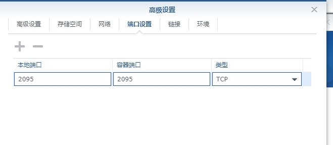
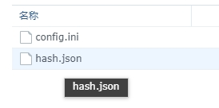

Telegram-Notice 使用说明

1. 下载源码
   首先，下载 Telegram-Notice 源码，并将 example.config.ini 文件替换为你自己的 bot token，并将文件重命名为 config.ini。

2. 运行软件
   运行软件，确保服务已经启动。

3. 获取用户 ID
   发送 /getwebhook 命令给你的 bot，bot 会返回当前用户对应的 ID，并进行 MD5 加密输出。

4. 发送消息
   使用以下两种方式发送消息：

GET 请求
发送 GET 请求到 http://127.0.0.1:8080/webhook/<bot 返回的 MD5>，并在参数中包含消息内容，比如 text=消息内容。

POST 请求
发送 POST 请求到 http://127.0.0.1:8080/webhook/<bot 返回的 MD5>，请求内容为你要发送的消息。

示例 CURL 命令
<BASH>

# POST 请求

curl --location --request POST "http://127.0.0.1:8080/webhook/<bot 返回的 MD5>" \
--header "User-Agent: Apifox/1.0.0 (https://apifox.com)" \
--data-raw "你真好呀"
通过以上步骤，你可以实现一个 bot 对应多个用户，进行消息分发和消息通知的功能。

# 现成的 bot!!

如果不想自己安装配置.这里给了一个作者自己搭建的**_[bot](https://t.me/fengtian_bot)_**
发送私聊`/gethook`会返回给你一段 md5
然后替换此 URL`https://notify.xsojson.com/webhook/<MD5>?text=hello word`
get 请求的话直接?txt=你要发送的内容即可

### POST 请求案例

`curl --location --request POST 'https://notify.xsojson.com/webhook/<MD5>' \
--header 'User-Agent: Apifox/1.0.0 (https://apifox.com)' \
--header 'Content-Type: application/json' \
--header 'Accept: */*' \
--header 'Host: notify.xsojson.com' \
--header 'Connection: keep-alive' \
--data-raw '你真是个大好人呢'
`
bot 会直接把 data-raw 的内容发送给目标用户.

# docker 部署

## 这里以群晖为例子.

### 正常安装 docker

注册表搜索`guanren/telegram`

双击下载.映像当中找到此文件双击加载到容器当中


### 设置储存空间和端口设置.如图设置即可



在`telegram-notify/config`下新建`config.ini`和`hash.json`


### config.ini 如图配置好自己的**_[bot key](https://www.teleme.io/articles/create_your_own_telegram_bot?hl=zh-hans)_**

config 文件内容为
```
[telegram]
telegram_apitoken=TOKEN
image_farm=Telegraph-Image_url
```
**然后正常运行即可**
参考此项目https://github.com/WingLim/ddns-telegram-bot
